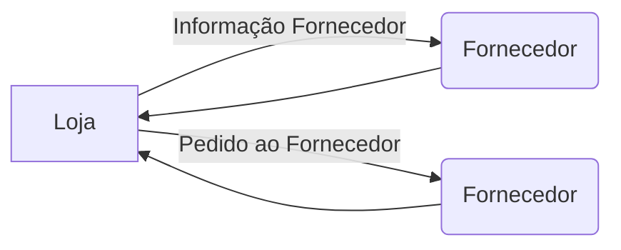

## O negocio

A Big Flower S.A e uma loja virtual que prove a venda / entrega de flores e afins em todo território nacional. Devido está abrangência todo o preparo e entrega do pedido é feito por um [Fornecedor](https://github.com/renatooa/spring-boot-microservice-fornecedor) mais próximo ao destinatário.

### Microservice Loja

Recebe o pedido do cliente após o destina ao Fornecedor apropriado através das requisições abaixo:
Requisições da Loja ao Fornecedor

### Pilha tecnológica
Projeto elaborado utilizando Spring Boot versão 2.3.3, utilizando a pilha tecnológica apresentada a baixo:
- __Eureka Cliente__ – Registro do Microservice no o [servidor de descobriment](https://github.com/renatooa/spring-boot-microservice-eureka-server)
- __Openfeign__ - Client Http Rest compatível com balanceamento de carga no lado do cliente
- __Sleuth__ - Prove mecanismos de rastreabilidade de Log Trace Distribuído.